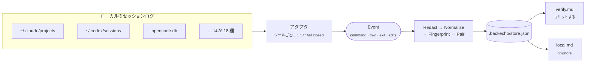

<div align="center">

# 🔁 backecho

**正しいテストコマンドは、エージェントがもう見つけている。毎回忘れさせるのはやめよう。**

backecho は AI コーディングツールがディスクに残すセッションログを読み、<br>
**本当に exit 0 で終わった** シェルコマンドだけを残して、次のセッションが参照する場所に書き出します。

[](https://github.com/euryopa/backecho/actions/workflows/ci.yml)
[](go.mod)
[](#-設計方針)
[](#-プライバシー)
[](LICENSE)

[English](README.md) · **日本語**

</div>

---

## ✨ なぜ作ったか

新しいエージェントセッションは、毎回同じことを調べ直すところから始まります。*`npm test` なのか `pnpm test` なのか？ `cargo test` には `-p api` が要る？ `pytest` はどのディレクトリから？* 答えは先週のトランスクリプトにもう書いてあります。ただし会話・計画・推論の山の下に。

backecho はそのトランスクリプトを **ローカルで**、**モデル呼び出しなしで** 掘り起こし、確かな証拠だけを残します。

> シェルコマンド · 実行ディレクトリ · 終了ステータス · 失敗から成功までの間に編集されたファイル

ツールをまたいで動きます。月曜に Claude Code が、火曜に Codex が通したコマンドは **1 行** にまとまり、両方の名前が付きます。

```markdown
## verify
- `cargo test -p api`
  cwd: .  ok: 7  fail: 1  last: 2026-10-04  via: codex, claude
  after: crates/api/src/lib.rs
  was: error[E0425]: cannot find value `token` in this scope
- `npm test`
  cwd: web  ok: 12  fail: 2  last: 2026-10-03  via: claude, cursor
  after: src/auth.ts
  was: Cannot find module '@/lib/auth'
```

## 🚀 クイックスタート

```sh
# 1. インストール（Go 1.25+）。Releases からバイナリを取ってきても OK
go install github.com/euryopa/backecho/cmd/backecho@latest

# 2. コーディングエージェントを使ったことのある git リポジトリで
cd ~/src/my-app
backecho sync

# 3. エージェントに参照先を教える（1 行、最初の 1 回だけ）
echo 'Before inventing a test or build command, read .backecho/verify.md.' >> CLAUDE.md
```

これで完了です。`backecho sync` はいつ再実行しても構いません。変化した分だけを読みます。

## 🧭 仕組み



1. **アダプタ** — ツールごとに専用パーサがあり、各ツール固有のログを 1 種類のイベント形式に写します。終了ステータスを証明できないログのコマンドは捨てます。知らない形式は推測せず、スキップして報告します。
2. **Redact（秘匿化）** — トークン、パスワード、API キー、秘密鍵、URL 内の認証情報を、書き出す前に取り除きます。`.env`・`*.pem`・`id_rsa` に触れるコマンドはまるごと捨てます。
3. **Normalize（正規化）** — 先頭の環境変数代入を外し（名前は残し、値は残さない）、`$HOME` とリポジトリのパスを相対化し、一時ディレクトリを `<tmp>`、ポートを `:PORT` に置き換えます。
4. **Fingerprint** — `sha256(cwd + command)`。エージェント名は含めないので、別ツールの同じコマンドは 1 つにまとまります。
5. **Keep（採用判定）** — エントリになるのは次のどちらかだけです。
   - **🔧 失敗 → 成功**：同じセッション内で、あるコマンドが失敗し、関連するコマンド（パス・パッケージ名・テスト名を共有）が 30 分以内に成功した。間の編集を `after`、失敗時の 1 行を `was` として記録します。
   - **✅ プロジェクト動詞**：既知の検証系コマンドの単独成功。`npm test`、`cargo clippy`、`go vet`、`pytest`、`make lint`、`./gradlew check` など。

   `ls`・`cat`・`git status`、インストール、開発サーバ、ウォッチャーは数えません。`npm test | tail` のようなパイプラインは、終了ステータスが `tail` のものなので無視します。

## 📦 書き出されるファイル

| ファイル | 内容 | コミット |
| --- | --- | :---: |
| `.backecho/verify.md` | 持ち運べるプロジェクトのコマンド。エージェントが読むファイル。 | ✅ |
| `.backecho/store.json` | `verify.md` の元データ（回数・日時・エージェント）。 | ✅ 任意 |
| `.backecho/local.md` | マシン固有のコマンド：絶対パス、ポート、環境変数の **名前**。 | 🚫 gitignore |
| `.backecho/local.json` | `local.md` の元データ。 | 🚫 gitignore |
| `.backecho/state.json` | 解析カーソル。次の sync で差分だけ読むため。 | 🚫 gitignore |

初回の `sync` で、gitignore 対象の 3 つのパスを `.gitignore` に追記します（1 回だけ）。`.gitignore` が無いリポジトリでは 1 回だけ警告し、ファイルは作りません。

> [!TIP]
> プルリクエストで `store.json` の差分が出るのが嫌なら、`.backecho/store.json` も `.gitignore` に入れて `verify.md` だけをコミットしてください。

## 🤝 エージェントへのつなぎ込み

backecho は指示ファイルを書き換えません。普段使っているツールが読むファイルに、次の 1 行を貼ってください。

```text
Before inventing a test or build command, read .backecho/verify.md.
```

| ツール | ファイル |
| --- | --- |
| Claude Code | `CLAUDE.md` |
| Codex CLI, Amp, OpenCode, Goose, Droid など | `AGENTS.md` |
| GitHub Copilot | `.github/copilot-instructions.md` |
| Cursor | `.cursor/rules/*.mdc` |
| Gemini CLI | `GEMINI.md` |
| Qwen Code | `QWEN.md` |
| Cline | `.clinerules` |
| aider | `CONVENTIONS.md`（`--read` で読み込む） |

> [!IMPORTANT]
> 貼るのは **参照先の 1 行** で、生成ファイルの中身ではありません。`verify.md` は頻繁に変わるので、キャッシュされる指示文の先頭に埋め込むと sync のたびにプロンプトキャッシュが無効になります。

## 🛠 コマンド

| コマンド | 動作 |
| --- | --- |
| `backecho sync` | 検出したすべてのエージェントのログからこのリポジトリ分を読み、`.backecho/` を更新 |
| `backecho sync --agent claude,codex` | 指定したアダプタだけ |
| `backecho sync --dry-run` | 生成される `verify.md` を標準出力に表示し、何も書かない |
| `backecho sync --since 2026-10-01` | この日付より前の記録を無視 |
| `backecho show [--json]` | ストアから `verify.md` と `local.md` を表示（`--json` で生エントリ） |
| `backecho status [--json]` | 全アダプタの `found` / `empty` / `skipped` とその理由 |
| `backecho stale [--json]` | 30 日間確認されていない、または失敗が成功より多いエントリ |
| `backecho path` | データディレクトリを表示 |

**オプション**：`--dir DIR` または `BACKECHO_DIR` でデータディレクトリを変更できます（既定は git トップレベルの `.backecho`）。ログは標準エラー、Markdown と `--json` は標準出力へ。成功時（「新しいものなし」を含む）は終了コード `0`、使い方の誤りや git リポジトリ外では `2` です。

<details>
<summary><b>例：<code>backecho status</code></b></summary>

```text
AGENT        STATE    SOURCES  EVENTS  DETAIL
claude       found    42       1830    42 files
codex        found    17       412     17 files
cursor       empty    -        -       no log root at /home/me/.cursor/projects
copilot      empty    -        -       no log root at /home/me/.copilot/session-state
opencode     found    1        96      1 database
…
```

</details>

## 🧩 対応エージェント

21 個のアダプタはすべてのビルドに含まれ、`backecho status` は常に全部を表示します。各ベンダーのログ形式は非公開で頻繁に変わるため、アダプタごとに「どこまで証明できるか」を示しています。

- 🟢 **検証済み** — ベンダーのソースコードまたは実ログで形式を確認済み、かつ終了ステータスが記録される
- 🟡 **ベストエフォート** — 公開ドキュメントや事例から形式を推定。厳格にパースし、合わなければ捨てる
- ⚪ **編集のみ** — ツールが終了ステータスを残さないため、コマンドは捨てる（編集は読む）

<!-- adapters-table:start -->
| エージェント | Id | ログ | 終了ステータスの出どころ | |
| --- | --- | --- | --- | :---: |
| Claude Code | `claude` | `~/.claude/projects/**/*.jsonl` | `is_error` + `Exit code N`、`toolUseResult` | 🟢 |
| Codex CLI | `codex` | `~/.codex/sessions/**/rollout-*.jsonl` | `exec_command_end.exit_code`、`metadata.exit_code` | 🟢 |
<!-- adapters-table:end -->

各アダプタのログの場所・環境変数・パース規則は [docs/adapters.md](docs/adapters.md) を参照してください。

## 🔒 プライバシー

- **ネットワーク通信なし。テレメトリなし。アカウント不要。** backecho はソケットを開きません。
- **LLM を使いません。** 要約はしません。読むのはコマンド文字列、終了ステータス、秘匿化済みの出力 1 行、編集されたパスだけです。
- **会話・推論・計画・出力全文は保存しません。**
- ベンダーのログやデータベースは **読み取り専用** で開きます。SQLite は `mode=ro` で開き、作成・マイグレーション・チェックポイントは一切しません。
- 秘密情報は書き出す **前** に取り除き、`.env`・`*.pem`・`id_rsa` に触れるコマンドは捨てます。迷ったら捨てます。

## 🧱 設計方針

- **単一の静的バイナリ。** Go、`CGO_ENABLED=0`、依存は 1 つだけ（純 Go の SQLite 実装 `modernc.org/sqlite`）。
- **エージェントを意識しないコア。** アダプタは 1 種類のイベントだけを出し、fingerprint・秘匿化・マージ・描画はベンダーのレコードを一切見ません。
- **Fail closed。** 不明な終了ステータスは不明のまま。0 とは見なしません。知らないスキーマはスキップし、`backecho status` で件数を出します。
- **exit 0 は正しさではない。** コマンドが最後まで走ったという意味です。`verify.md` の冒頭にもそう書いてあります。

## 🧑‍💻 コントリビュート

```sh
CGO_ENABLED=0 go test ./...
CGO_ENABLED=0 go build -o backecho ./cmd/backecho
```

いちばん価値があるのは、🟡 や ⚪ のアダプタ向けの **実ログ由来の fixture** です。使い捨てのリポジトリでツールに「失敗 → 編集 → 成功」をやらせ、ユーザー名・パス・出力を消して `testdata/<agent>/` に置き、PR を送ってください。詳しくは [docs/adapters.md](docs/adapters.md#adding-or-fixing-an-adapter) を参照してください。

## 📄 ライセンス

[MIT](LICENSE)
