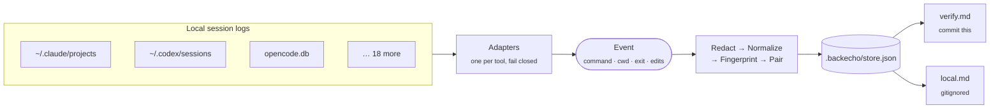

<div align="center">

# 🔁 backecho

**Your coding agents already found the right test command. Stop letting them forget it.**

backecho reads the session logs your AI coding tools leave on disk,<br>
keeps only the shell commands that **actually exited 0**, and writes them where the next session will look.

[](https://github.com/euryopa/backecho/actions/workflows/ci.yml)
[](go.mod)
[](#-design-principles)
[](#-privacy)
[](LICENSE)

**English** · [日本語](README.ja.md)

</div>

---

## ✨ Why

Every new agent session starts by rediscovering the same things: *is it `npm test` or `pnpm test`? Does `cargo test` need `-p api`? Which directory does `pytest` run from?* The answer is already sitting in last week's transcripts — buried under chat, plans and reasoning.

backecho mines those transcripts **locally**, with **no model calls**, and keeps only hard evidence:

> a shell command · the directory it ran in · its exit status · the files edited between a failure and the success that followed

It works across tools. A command Claude Code confirmed on Monday and Codex confirmed on Tuesday is **one row**, credited to both.

```markdown
## verify
- `cargo test -p api`
  cwd: .  ok: 7  fail: 1  last: 2026-10-04  via: codex, claude
  after: crates/api/src/lib.rs
  was: error[E0425]: cannot find value `token` in this scope
- `npm test`
  cwd: web  ok: 12  fail: 2  last: 2026-10-03  via: claude, cursor
  after: src/auth.ts
  was: Cannot find module '@/lib/auth'
```

## 🚀 Quick start

```sh
# 1. Install (Go 1.25+), or grab a binary from Releases
go install github.com/euryopa/backecho/cmd/backecho@latest

# 2. In any git repo you have used a coding agent in
cd ~/src/my-app
backecho sync

# 3. Tell your agents where to look (one line, once)
echo 'Before inventing a test or build command, read .backecho/verify.md.' >> CLAUDE.md
```

That's it. Re-run `backecho sync` whenever you like — it only reads what changed.

## 🧭 How it works



1. **Adapters** — each tool has its own parser that maps its native log onto one event shape. If a log can't prove an exit status, the command is dropped. Unknown formats are skipped and reported, never guessed at.
2. **Redact** — tokens, passwords, API keys, private keys, and URL credentials are removed before anything is written. Commands that touch `.env`, `*.pem`, or `id_rsa` are dropped entirely.
3. **Normalize** — env assignments are stripped (names kept, values never), `$HOME` and the repo path become relative, temp dirs become `<tmp>`, ports become `:PORT`.
4. **Fingerprint** — `sha256(cwd + command)`. The agent is not part of it, so the same command from two tools merges.
5. **Keep** — an entry is created only when:
   - **🔧 failure → success**: in one session, a command failed and a related command (sharing a path, package or test name) passed within 30 minutes. Edits in between are recorded as `after`, the failure line as `was`; or
   - **✅ project verb**: a bare success of a known verify verb — `npm test`, `cargo clippy`, `go vet`, `pytest`, `make lint`, `./gradlew check`, …

   `ls`, `cat`, `git status`, installs, dev servers and watchers never count. A pipeline like `npm test | tail` is ignored because its exit status belongs to `tail`.

## 📦 What gets written

| File | What | Commit it? |
| --- | --- | :---: |
| `.backecho/verify.md` | Portable project commands. The file agents read. | ✅ |
| `.backecho/store.json` | Source of truth for `verify.md` (counts, timestamps, agents). | ✅ optional |
| `.backecho/local.md` | Machine-specific commands: absolute paths, ports, env var **names**. | 🚫 gitignored |
| `.backecho/local.json` | Source of truth for `local.md`. | 🚫 gitignored |
| `.backecho/state.json` | Parse cursor, so the next sync reads only what changed. | 🚫 gitignored |

On the first `sync`, backecho appends the three gitignored paths to your `.gitignore` (once). If the repo has no `.gitignore`, it warns once and creates nothing.

> [!TIP]
> If you'd rather not churn `store.json` in pull requests, add `.backecho/store.json` to `.gitignore` too and commit only `verify.md`.

## 🤝 Hooking it up to your agent

backecho never edits your instruction files. Paste this one line into whichever file your tool already reads:

```text
Before inventing a test or build command, read .backecho/verify.md.
```

| Tool | File |
| --- | --- |
| Claude Code | `CLAUDE.md` |
| Codex CLI, Amp, OpenCode, Goose, Droid … | `AGENTS.md` |
| GitHub Copilot | `.github/copilot-instructions.md` |
| Cursor | `.cursor/rules/*.mdc` |
| Gemini CLI | `GEMINI.md` |
| Qwen Code | `QWEN.md` |
| Cline | `.clinerules` |
| aider | `CONVENTIONS.md` (via `--read`) |

> [!IMPORTANT]
> Paste the **pointer**, not the generated file. `verify.md` changes often; inlining it into a cached instruction prefix would invalidate prompt caches on every sync.

## 🛠 Commands

| Command | Does |
| --- | --- |
| `backecho sync` | Scan every detected agent's logs for this repo and update `.backecho/`. |
| `backecho sync --agent claude,codex` | Only these adapters. |
| `backecho sync --dry-run` | Print the rendered `verify.md` to stdout; write nothing. |
| `backecho sync --since 2026-10-01` | Ignore records before this date. |
| `backecho show [--json]` | Print `verify.md` + `local.md` from the store, or the raw entries. |
| `backecho status [--json]` | Every adapter: `found`, `empty`, or `skipped` — and why. |
| `backecho stale [--json]` | Entries not confirmed in 30 days, or failing more than passing. |
| `backecho path` | Print the data directory. |

**Options.** `--dir DIR` or `BACKECHO_DIR` moves the data directory (default: `.backecho` at the git toplevel). Logs go to stderr; markdown and `--json` go to stdout. Exit `0` on success (including "nothing new"), `2` on a usage error or outside a git repo.

<details>
<summary><b>Example: <code>backecho status</code></b></summary>

```text
AGENT        STATE    SOURCES  EVENTS  DETAIL
claude       found    42       1830    42 files
codex        found    17       412     17 files
cursor       empty    -        -       no log root at /home/me/.cursor/projects
copilot      empty    -        -       no log root at /home/me/.copilot/session-state
opencode     found    1        96      1 database
…
```

</details>

## 🧩 Supported agents

All 21 adapters ship in every build, and `backecho status` always lists them all. Vendor log formats are undocumented and change often, so each adapter states how much it can prove:

- 🟢 **verified** — format checked against the vendor's source code or real logs, and exit status is recorded
- 🟡 **best effort** — format from public docs or examples; parses strictly and fails closed
- ⚪ **edits only** — the tool doesn't record exit status, so commands are dropped (edits are still read)

<!-- adapters-table:start -->
| Agent | Id | Logs | Exit status from | |
| --- | --- | --- | --- | :---: |
| Claude Code | `claude` | `~/.claude/projects/**/*.jsonl` | `is_error` + `Exit code N`, `toolUseResult` | 🟢 |
| Codex CLI | `codex` | `~/.codex/sessions/**/rollout-*.jsonl` | `exec_command_end.exit_code`, `metadata.exit_code` | 🟢 |
<!-- adapters-table:end -->

See [docs/adapters.md](docs/adapters.md) for each adapter's log location, env override, and parsing rules.

## 🔒 Privacy

- **No network. No telemetry. No account.** backecho never opens a socket.
- **No LLM.** Nothing is summarized; only command text, exit status, one redacted line of output, and edited paths are read.
- **No chat, no reasoning, no plans, no full output** are stored.
- Vendor logs and databases are opened **read-only**. SQLite is opened with `mode=ro`; backecho never creates, migrates, or checkpoints a database.
- Secrets are redacted **before** anything is written, and any command touching `.env`, `*.pem` or `id_rsa` is dropped. When in doubt, it drops.

## 🧱 Design principles

- **Single static binary.** Go, `CGO_ENABLED=0`, one dependency (`modernc.org/sqlite`, a pure-Go SQLite).
- **Agent-blind core.** Adapters emit one event type. Fingerprinting, redaction, merge and render never see a vendor record.
- **Fail closed.** Unknown exit status is unknown — never treated as 0. Unknown schemas are skipped and counted in `backecho status`.
- **Exit 0 is not correctness.** It means the command finished. `verify.md` says so at the top.

## 🧑‍💻 Contributing

```sh
CGO_ENABLED=0 go test ./...
CGO_ENABLED=0 go build -o backecho ./cmd/backecho
```

The most valuable contribution is a **fixture from a real log** for an adapter marked 🟡 or ⚪. Run a tool through *fail → edit → pass* in a throwaway repo, scrub usernames, paths and output, and open a PR with it under `testdata/<agent>/`. See [docs/adapters.md](docs/adapters.md#adding-or-fixing-an-adapter).

## 📄 License

[MIT](LICENSE)
