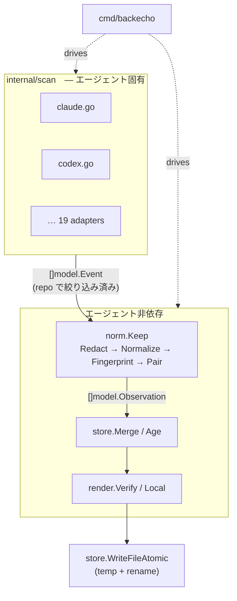

# 🗺️ backecho 実装方針

元仕様 **「worked: Go implementation spec」** をどう実装したか。仕様の曖昧な点をどう決めたか、どこを変えたか。

[README](../README.ja.md) · [アダプタ一覧](adapters.md) · [English README](../README.md)

---

> [!NOTE]
> 仕様本文はそのまま正とし、このドキュメントには **差分と判断** だけを書いています。
> v0.1 の範囲（仕様の実装順 1〜6）はすべて実装済みです。

## 📌 目次

1. [命名](#1-命名)
2. [全体アーキテクチャ](#2-全体アーキテクチャ)
3. [仕様の曖昧点と決定](#3-仕様の曖昧点と決定)
4. [仕様からの変更点](#4-仕様からの変更点)
5. [アダプタの方針](#5-アダプタの方針)
6. [テスト](#6-テスト)
7. [リリースと CI](#7-リリースと-ci)
8. [リスクと今後](#8-リスクと今後)

---

## 1. 命名

仕様の `worked` はすべて `backecho` に読み替えています。

| 仕様 | backecho |
| --- | --- |
| `module github.com/worked/worked` | `module github.com/euryopa/backecho` |
| バイナリ `worked` / `cmd/worked` | `backecho` / `cmd/backecho` |
| `./.worked` / `WORKED_DIR` | `./.backecho` / `BACKECHO_DIR` |
| `Generated by \`worked sync\`` | `Generated by \`backecho sync\`` |

## 2. 全体アーキテクチャ

| パッケージ | 役割 | import してよいもの |
| --- | --- | --- |
| `cmd/backecho` | フラグ、サブコマンド、終了コード、gitignore 追記 | すべて |
| `internal/model` | `Event` / `Observation` / `Entry` / `Store` / `AdapterStatus` | なし |
| `internal/scan` | アダプタ、JSONL walker、read-only SQLite | `model`, `norm` |
| `internal/norm` | Redact / Normalize / Fingerprint / 動詞判定 / `Keep`（ペアリング） | `model` |
| `internal/store` | Merge、stale、カーソル、atomic write、gitignore | `model`, `norm` |
| `internal/render` | `verify.md` / `local.md` | `model` |

- `internal/scan` を import するのは `cmd/backecho` だけ。
- `norm` / `store` / `render` は `time.Now()` を呼ばない。時刻は `cmd` から `now` で渡す。
- 外部依存は `modernc.org/sqlite` のみ。`CGO_ENABLED=0`。

## 3. 仕様の曖昧点と決定

<b>3.1 失敗 → 成功のペアリング</b>

- エントリになるのは **成功した側** の fingerprint。失敗側は別コマンドでもよい（`go test ./auth -run TestLogin` 失敗 → `go test ./auth` 成功）。
- 「トークンを共有する」は次のいずれか：
  - 正規化後のコマンドが同一
  - 先頭 2 語（動詞 + サブコマンド）が同じ（`npm test` と `npm test -- auth`）
  - パス要素・拡張子抜きのファイル名・`-p`/`-k` などの値が共通（`test` `run` `src` などの汎用語は除外）
- 30 分窓。どちらかのタイムスタンプが無いときは窓を問わない。
- ペアされた成功は `fail_count += 1`、`was` に失敗の 1 行、`after` に間の編集パス（repo 相対・最大 8）。
- 1 つの成功が、関連する未解決の失敗をまとめて解決する。`was` は最も新しい失敗から取る。

<b>3.2 「プロジェクト動詞」判定表</b>

| 動詞 | 採用するもの |
| --- | --- |
| `npm` `pnpm` `yarn` `bun` | `test` / `t`、または script 名に `test` `lint` `build` `check` `typecheck` `tsc` `migrate` `e2e` を含む（`dev` `start` `serve` `watch` `install` は不採用） |
| `npx`（`pnpm exec`, `bunx` 等も） | `vitest` `jest` `tsc` `eslint` `playwright` `mocha` `biome` … / `prisma migrate` / `prettier --check` |
| `cargo` | `test` `build` `check` `clippy` `nextest` / `fmt --check` |
| `go` | `test` `build` `vet` |
| `pytest` `mypy` `tox` `ruff check` | 常に |
| `python` | `-m pytest\|unittest\|mypy`, `manage.py test\|migrate\|check` |
| `make` `just` `task` | ターゲット名に上のキーワードを含む（引数なしは不採用） |
| `mvn` `gradle`（`./mvnw` `./gradlew`） | `test` `verify` `build` `check` `compile` … |
| その他 | `dotnet test/build`, `swift test/build`, `xcodebuild … test`, `mix test`, `rake test`, `bundle exec rspec`, `composer test`, `deno test` |

ラッパー（`uv run`, `poetry run`, `bundle exec`, `sudo`, `time`）は剥がしてから判定します。

<b>3.3 終了ステータスを信用しない形</b>

| 形 | 扱い | 理由 |
| --- | --- | --- |
| `a \| b` | 無視 | 終了ステータスは `b` のもの（`npm test \| tail` は `tail` の成功） |
| `a ; b`, `a \|\| b` | 無視 | 同上 |
| `a && b` | 採用 | 0 なら全段成功 |
| 末尾 `&` | 無視 | バックグラウンド |
| `cd DIR && cmd` | `cwd` を DIR に移して `cmd` を評価 | エージェントが多用する形 |
| 開発サーバ・ウォッチャー | 無視 | `next dev`, `vite`, `cargo watch`, `go run`, `--watch` など |

<b>3.4 <code>class: local</code> と環境変数</b>

- 正規化で剥がした env 代入の **名前** を `Entry.env` に持つ。値はどこにも書かない。
- `local` になる条件：env 名あり／絶対パス／`~`／`:PORT`／`<tmp>`。
- 同じ fingerprint が env なしでも成功したら、移植可能と分かったので `verify` に昇格し env 名を消す。

<b>3.5 インクリメンタル解析（カーソル）</b>

仕様は「ファイルは byte offset」ですが、以下の理由で **イベント数ウォーターマーク** にしました。

- tool call と result が別の sync に分かれると offset では pair できない
- 前回の失敗と今回の成功をペアにしたい
- Gemini / Amp / Cline などはターンごとに JSON ファイル全体を書き直す

方式：

1. `state.json` にハンドルごとの `size` / `mtime` / `events`（前回までに数えた repo イベント数）を保存。
2. size も mtime も同じなら **パースしない**（仕様テスト 11）。
3. 変わっていたら全体を再パースし、先頭 `events` 件は「既読」として **ペアリングには参加するが数えない**。
4. size 縮小・mtime 巻き戻りは既読 0 で再スキャン（仕様通り）。
5. SQLite は `-wal` の size / mtime も合算して変化を検知。
6. `--since` はパース後に適用し（古いイベントは既読扱い）、カウントがぶれないようにする。

既知の割り切り：sync がコマンド実行中に走ると、その 1 件の結果は次回「既読」扱いになり数えられない（偽陰性側に倒す）。

<b>3.6 その他</b>

- `StdoutHead` / `StderrHead`：最初の **空でない** 行、ANSI 除去、200 rune、秘匿化済み。
- 秘匿化は正規化の **前** と、`was` を作る直前の 2 回。
- `.env` 判定はコマンド中の全トークンと編集パスの両方。`.env` への編集は `after` に入れない。
- パス比較は記録どおり → シンボリックリンク解決後の順で `filepath.Rel`。macOS の `/var` ↔ `/private/var`、Git Bash 形式 `/c/Users/...` も吸収。
- git トップレベルは `.git`（ディレクトリまたは worktree のファイル）を上方向に探す。`git` コマンドは呼ばない。
- `via:` は最後に確認したエージェントを先頭に、残りを続ける。

## 4. 仕様からの変更点

> [!IMPORTANT]
> どれも仕様の受け入れ条件より **厳しい／安全側** の変更で、互換性を壊しません。

| # | 仕様 | 変更 | 理由 |
| --- | --- | --- | --- |
| 1 | `store.json` に全エントリ | verify は `store.json`、local は **`local.json`** に分離 | local エントリ（絶対パス・ポート・env 名）をコミットさせない |
| 2 | gitignore は `local.md` のみ | `local.md` / `local.json` / **`state.json`** を追記 | `state.json` はログの絶対パス（ユーザー名入り）を含む |
| 3 | `Entry` スキーマ | `last_agent` / `env` / `stale_since` / `session_keys` を追加（すべて omitempty） | `via` の先頭、env 名、「stale から 30 日で削除」、セッション数の重複排除に必要 |
| 4 | `Store` スキーマ | `open` 配列を追加 | open failures（7 日で失効）と次回 sync でのペア解決 |
| 5 | byte offset カーソル | イベント数ウォーターマーク | 3.5 のとおり |
| 6 | `Discover(home, env)` のみ | 任意インターフェース `RepoAdapter.DiscoverRepo(root)` を追加 | `.crush/crush.db`・`.aider.chat.history.md` は repo の場所が必要 |
| 7 | — | `fail` 数を行に表示、`env:` 行を local に表示 | 判断材料。行の形は仕様と同じ |

## 5. アダプタの方針

- 21 アダプタすべてを `scan.All()` に登録。`backecho status` は常に全部を出す。
- 各アダプタは **自分のファイル・自分の fixture** を持ち、共有の曖昧パーサは使わない（共有するのは JSONL スキャナと call/result の突き合わせだけ）。
- 終了ステータスは **構造化フィールド** か、**ツール自身が出力に書く終了行**（例：Gemini の `Exit Code: N`）からだけ取る。`is_error == false` やモデルの発言からは推測しない。
- 証明できないツールは「編集のみ」として出荷し、理由をドキュメントに書く。

詳細は **[docs/adapters.md](adapters.md)**。

## 6. テスト

すべて `CGO_ENABLED=0 go test ./...`、テーブル駆動、ネットワーク・実エージェント不要。

<b>仕様テスト 1〜14 の対応表</b>

| # | 内容 | テスト |
| ---: | --- | --- |
| 1 | 失敗→成功＋共有パスで 1 エントリと `after` | `norm.TestKeep/failure_then_success…`, `store.TestMergeFailThenSuccess` |
| 2 | `ls` の exit 0 は捨てる | `norm.TestKeep/ls_exiting_0…` |
| 3 | 単独の `npm test` 成功は残す | `norm.TestKeep/bare_npm_test…` |
| 4 | 2 エージェントの同一コマンドは 1 行 | `store.TestSpec04_TwoAgentsOneRow` |
| 5 | home とトップレベルが同じ fingerprint に | `norm.TestSpec05_SameFingerprint` |
| 6 | stderr の bearer が `was` に出ない | `norm.TestSpec06_BearerNotInWas` |
| 7 | `.env` の読み取りは無視 | `norm.TestKeep/.env_read…` |
| 8 | `FOO=bar` は名前だけ `local.md` へ | `store.TestSpec08_EnvNameOnly`, `cmd.TestLocalEntriesStayLocal` |
| 9 | 30 日超は stale | `store.TestSpec09_Stale` |
| 10 | 壊れた JSONL 行はスキップ | `scan.TestSpec10_TruncatedLineSkipped` |
| 11 | 変化なしの 2 回目 sync は新規ゼロ | `cmd.TestSyncEndToEnd` |
| 12 | gitignore 追記は 1 回 | `store.TestSpec12_GitignoreOnce` |
| 13 | `Exit == nil` はエントリにならない | `norm.TestKeep/nil_exit…`, 全アダプタの契約テスト |
| 14 | エージェントのルートが無くても失敗しない | `scan.TestSpec14_MissingRootsAreEmpty` |

**アダプタ契約テスト**（`internal/scan/contract_test.go`）：全 fixture をパイプライン全体に通し、次を検査します。

- 植えた秘密（`SECRETTOKEN123`）が `verify.md` / `local.md` / `store.json` に出ない
- 終了ステータス不明のコマンド（`make test-unknown`）がエントリにならない
- repo 外セッション（`make test-elsewhere`）が出てこない
- 失敗→編集→成功が 1 エントリになり、`after` と `via` が正しい（終了ステータスを証明できるアダプタのみ）

SQLite fixture はテスト内で `modernc.org/sqlite` を使って生成し、バイナリはコミットしません。

## 7. リリースと CI

| ワークフロー | 内容 |
| --- | --- |
| `ci.yml` | ubuntu / macOS で `gofmt` → `go vet` → `go test` → build。Windows は build と vet |
| `release.yml` | `v*` タグで test → linux / darwin / windows × amd64 / arm64 を `go build`（`-trimpath -ldflags "-X main.version=…"`）→ GitHub Release に添付 |

## 8. リスクと今後

| リスク | 対策 |
| --- | --- |
| ベンダーのログ形式が変わる | アダプタは fail closed。知らないスキーマはファイル単位でスキップし `status` に件数を出す |
| 非公開ツールの形式が推測 | 🟡 と明示。実ログ fixture の提供を Issue テンプレートで募集 |
| ログに機密が含まれる | コマンド・終了ステータス・先頭 1 行・パスしか取り出さず、書き出し前に秘匿化 |
| 20 個超のアダプタの保守 | 契約テストで共通の受け入れ条件を自動化 |

**今後の候補**

- [ ] `backecho sync --watch` は作らない（常駐はしない方針）。代わりに git hook / シェルのプロンプトフックの例をドキュメント化
- [ ] Windows でのテスト実行（現状は build のみ CI）
- [ ] 実ログ fixture の拡充（🟡 → 🟢）
